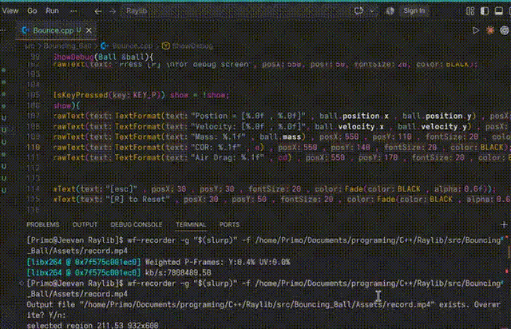

# Bouncing Ball

So this was to simulate the bounciness of a ball using some physics concepts.

## Concepts

### - **Acceleration due to Gravity [g]**

The constant acceleration gained by an object falling freely toward a massive body.

### - **Coefficient of Restitution [e]**

1. It represents the elasticity of an object after a collision, or simply, its **bounciness**.
2. **e = 1** indicates **Perfect Elasticity**, i.e., no energy is lost after the collision.
3. **e = 0** indicates a **Perfectly Inelastic Collision**, i.e., the object does not bounce after the collision.
4. **0 < e < 1** indicates an **Inelastic Collision**, i.e., some energy is lost after the collision, such as through heat, sound, deformation, etc.
5. **The Standard Formula**

$$
e = \frac{|v_f|}{|v_i|}
$$

* **$v_f$** = Final velocity (speed **after** collision)
* **$v_i$** = Initial velocity (speed **before** collision)

### - **Air Drag [c]**

1. The frictional force that acts when an object moves through air is called **Air Drag [Air Resistance]**.
2. The Drag Coefficient $C_d$ is a dimensionless number that measures how much aerodynamic resistance an object experiences.

|   $C_d$ value  | Effect              |
| :------------: | :------------------ |
| $\approx 0.04$ | Highly aerodynamic  |
| $\approx 0.47$ | Moderate resistance |
| $\approx 1.05$ | Less aerodynamic    |

## Calculation

We first calculate:

* Force acting on the Y-axis:

$$
F_y = m \times g
$$

* Then we subtract velocity multiplied by air resistance:

$$
F_x = F_x - (v_x \times C_d)
$$

$$
F_y = F_y - (v_y \times C_d)
$$

* By Newton's Second Law:

$$
a_y = \frac{F_y}{m}
$$

$$
a_x = \frac{F_x}{m}
$$

## Controls

|       Key       | Function                            |
| :-------------: | :---------------------------------- |
|      **P**      | Show Debug Screen                   |
|      **R**      | Reset Stats                         |
|     **Esc**     | Exit                                |
| **Mouse Touch** | Teleports the ball to that position |
