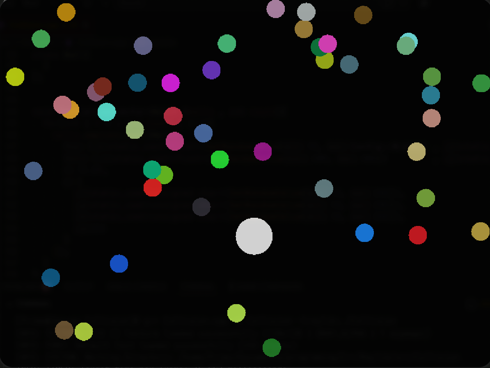

# Collision and Player control



## About 

- Simple player control and Collision detection using raylib and C++

- Used simple physics to detect player and the balls

### Controls
|Action | Key  |
|:----: | :---:|
|Up     | W    |
|Down   | S    |
|Left   | A    |
|Right  | D    |

<br>

### Architecture
```
Collision
├── Assets
│   └── image.png
├── Collision
├── Collision.cpp
└── README.md
```

